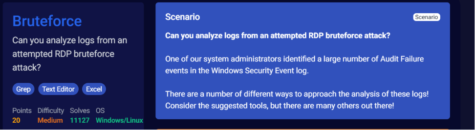
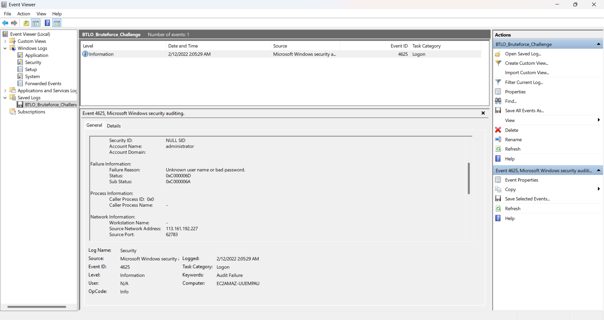
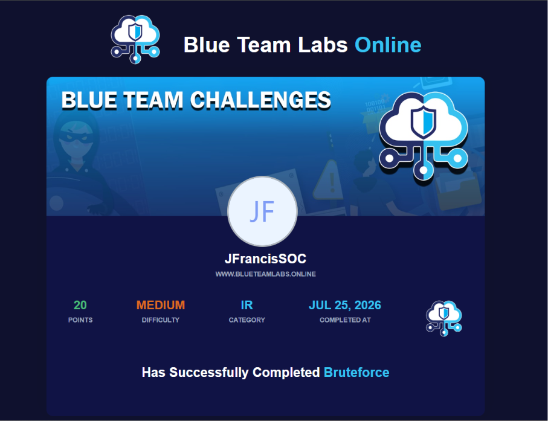

# 🛡️ BTLO-03: Bruteforce


## Overview

This repository contains my completed **Bruteforce** challenge from **Blue Team Labs Online (BTLO).**

In this challenge, I investigated Windows Security Event Logs to analyze an attempted Remote Desktop Protocol (RDP) brute-force attack. The investigation focused on identifying failed logon attempts, determining the targeted account, identifying the attacker's source IP address, and reviewing authentication activity recorded in the Windows Security logs.

This lab gave me hands-on experience working with Windows Event Logs and reinforced how authentication events can be used to identify brute-force attacks.

> **Note:** This repository does **not** include challenge answers or walkthroughs. It focuses on the investigation process, the skills I practiced, and what I learned throughout the challenge.

---

# Challenge Information

| Field | Information |
|:------|:------------|
| Platform | Blue Team Labs Online |
| Challenge | Bruteforce |
| Category | Windows Security |
| Difficulty | Medium |
| Points Earned | 20 |
| Status | ✅ Completed |

---

# Skills I Practiced

- Windows Event Log Analysis
- Authentication Investigation
- Failed Logon Analysis
- Event ID Analysis
- IOC Collection
- Source IP Identification
- Windows Event Viewer
- Security Investigation
- Threat Analysis
- Security Documentation

---

# Topics Covered

- Windows Security Event Logs
- Event ID 4625
- Failed Logon Events
- Windows Authentication
- NTLM Authentication
- Remote Desktop Protocol (RDP)
- Brute Force Attacks
- Authentication Logs
- Source IP Analysis
- Windows Event Viewer
- Audit Failure Events
- Logon Type 3
- Indicators of Compromise (IOCs)
- Security Operations Center (SOC) Investigations

---

# Investigation Workflow

1. Reviewed the challenge scenario.
2. Opened the Windows Security Event Logs.
3. Identified failed authentication events.
4. Determined the targeted account.
5. Identified the attacker's source IP address.
6. Reviewed failure reasons and authentication details.
7. Determined the scope of the brute-force activity.
8. Documented the investigation findings.

---

# Tools Used

- Windows Event Viewer
- Excel
- Notepad++
- Grep
- Blue Team Labs Online

---

# Challenge Walkthrough

## Step 1 - Challenge Overview

I reviewed the challenge scenario to understand the investigation objective before beginning the analysis. The challenge focused on analyzing Windows Security Event Logs from an attempted RDP brute-force attack.



---

## Step 2 - Investigating the Windows Security Logs

I analyzed the Windows Security Event Logs using Event Viewer to identify failed authentication attempts, determine the targeted account, identify the attacking source IP address, and review the authentication activity associated with the attack.



---

## Step 3 - Challenge Completed

After reviewing the event logs, identifying the attack details, and validating my findings, I successfully completed the BTLO Bruteforce challenge.



---

# Key Takeaways

This challenge gave me hands-on experience investigating Windows authentication events and recognizing the indicators of a brute-force attack.

I learned how to:

- Analyze Windows Security Event Logs.
- Investigate Event ID 4625.
- Identify failed authentication attempts.
- Determine the targeted account.
- Identify the attacker's source IP address.
- Review Windows authentication activity.
- Document investigation findings.

---

# Investigation Summary

During this investigation, I analyzed Windows Security Event Logs to identify repeated failed authentication attempts against a local administrator account. By reviewing authentication events, failure reasons, and network information, I identified key indicators associated with a brute-force attack and documented the findings using a structured investigation process.

---

# Repository Structure

```text
BTLO-03-Bruteforce
│
├── README.md
├── 01-BTLO-Bruteforce-Challenge-Overview.png
├── 02-BTLO-Bruteforce-Evidence.png
└── 03-BTLO-Bruteforce-Challenge-Completed.png
```

---

# Continuous Learning

I am continuing to build hands-on cybersecurity experience through:

- Blue Team Labs Online
- SOC Investigation Case Files
- Microsoft Sentinel
- Splunk
- Wireshark
- KQL
- MITRE ATT&CK

Every investigation helps me strengthen my analytical thinking, improve my documentation skills, and gain experience with real-world SOC workflows.

---

# Connect With Me

## LinkedIn

https://www.linkedin.com/in/jfrancissoc/
